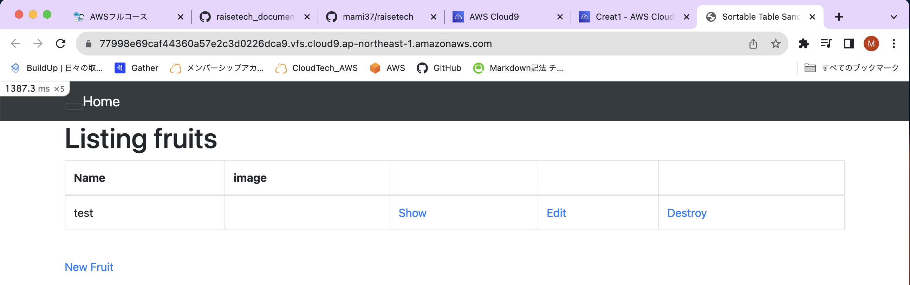
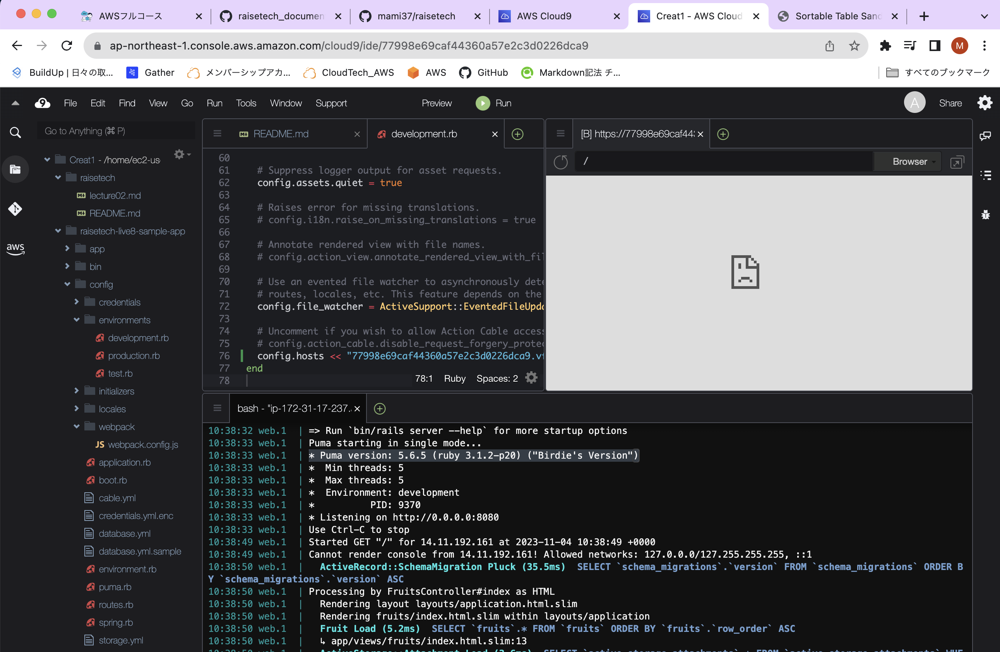
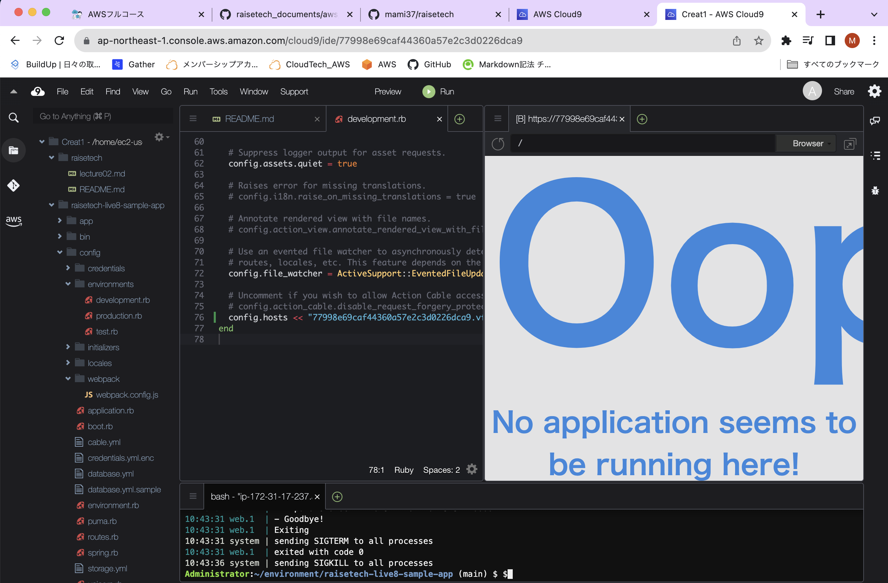
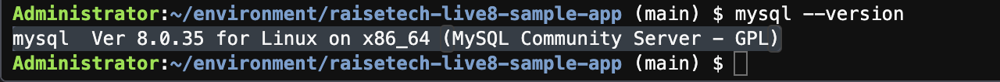
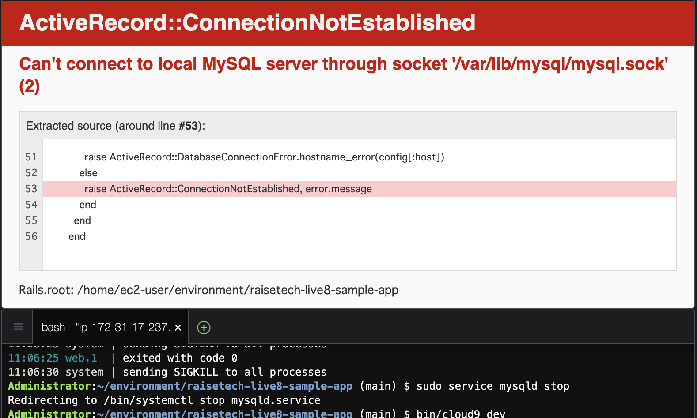
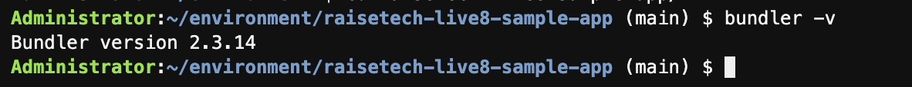

# 第３回課題について
__1. サンプルアプリケーションの起動__　　
  

__2. APサーバーについて__  
APサーバー＝アプリケーションサーバーの略称  
アプリケーション(アプリ)の実行環境を提供し、クライアントの通信を処理、データベースや他のリソースとの連携を管理する役割を果たす。  
[名前：Puma　バージョン：5.6.5]　　
  

* APサーバーを終了させるとアプリケーションにアクセスできない  
  

__3. DBサーバーについて__  
DBサーバー＝データベースサーバーの略称  
データベースを管理し、データの保存や取得などの処理をする。  
データベース＝情報を整理して保存する場所  
[名前：MySQL　バージョン：8.0.35]  
  

[APサーバーとDBサーバーの関係性]  
APサーバーはユーザーからの要求を受け取り、データベースからデータを取得しそれを処理してユーザーに提供する中間的な役割を果たす。  
DBサーバーはデータベースの管理と保管を担当し、APサーバーはそのデータに基づいてアプリケーションを構築し、ユーザーとの対話を可能にする。  

* DBサーバーを停止させるとアプリケーションにアクセスできない  
  

__4. Railsの構成管理ツールについて__  
[名前：Bundler　バージョン：2.3.14]  
  
* RailsはWebアプリケーションを開発するためのフレームワーク  
* BundlerはGemの依存関係を管理すためのツール  
* GemはRubyプロジェクトにおいて使われる拡張機能やライブラリのパッケージ  

__5. 課題から学んだこと__  
* サンプルアプリケーションの起動  
* 各サーバーの役割と関係性  
* GitHubへの画像アップロードとPR内での画像の表示と使用するマークダウン/マークアップの違い　　

今回の課題では、一気にレベルが上がり戸惑うこともあったが、一つ一つ調べながら理解し進めたと思う。  
ただ、完全ではなく曖昧な部分もあるため、今後の課題を進める中できちんと習得していきたい。  
