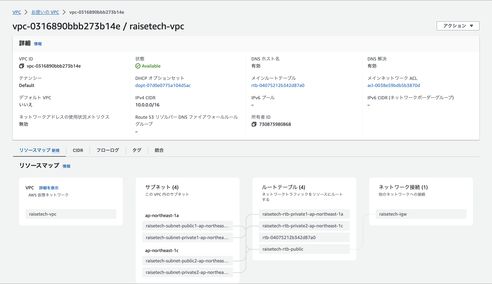
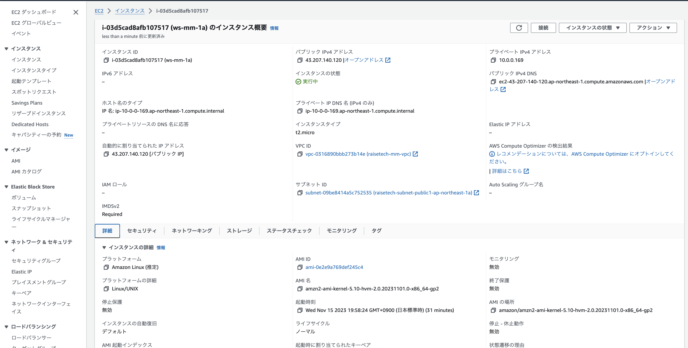
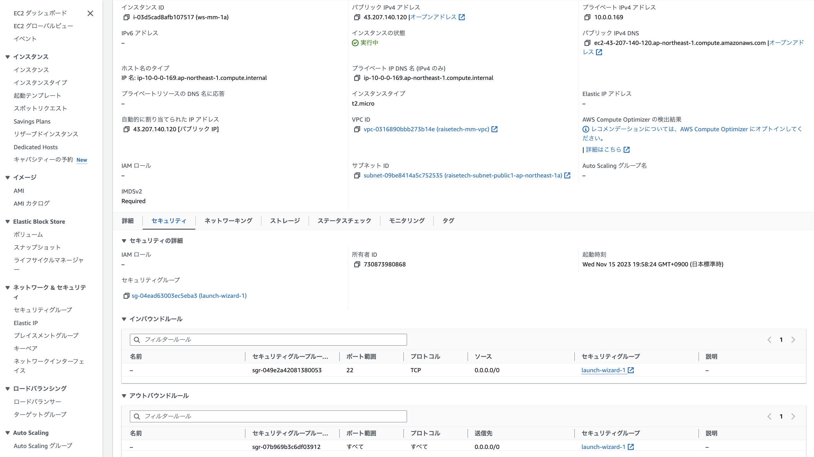
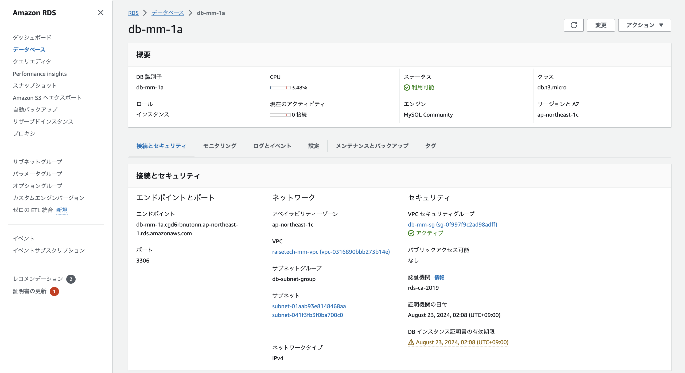
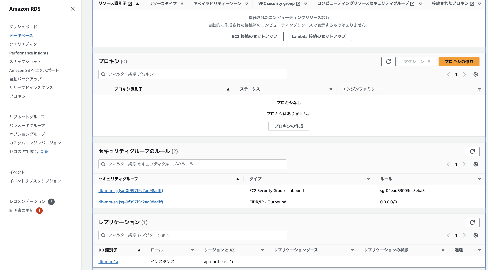
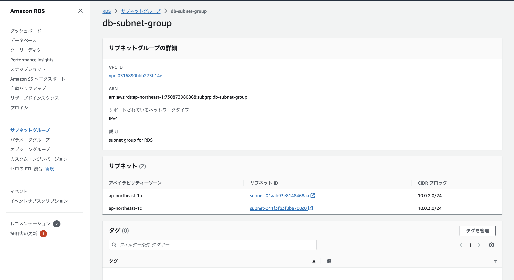
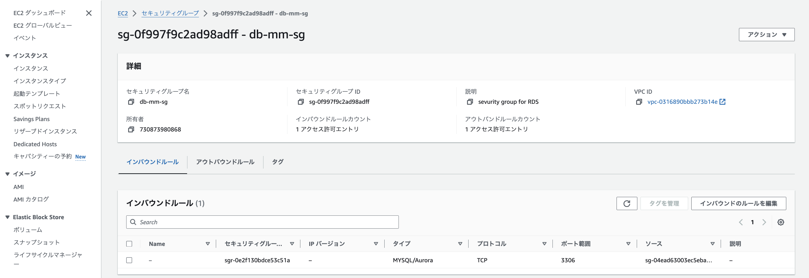
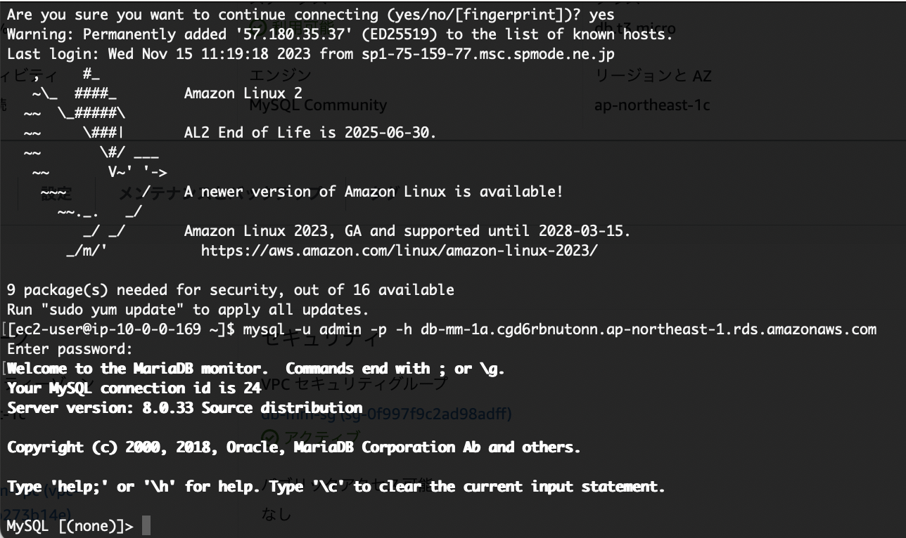

# 第４回課題について
__1. VPCとサブネットを構築__  

__2. EC2とRDSの作成__　　
* EC2  

* EC2 -セキュリティグループ

* RDS  
  

* サブネットグループの設定

* セキュリティグループのインバウンドルールの設定（アウトバウンドルールはデフォルトのままとした）

__3. EC2からRDSへ接続__  
* 正常であることを確認  
  

__4. 課題から学んだこと__  
今回の課題は、スタートからつまづき自分自身の固定概念から抜け出すのに苦労した。  
今後は混乱する前に、確認や相談を行う様にしたい。  
* メモ  
RDSのサブネットグループは、RDSインスタンスが配置されうるVPCサブネットをグループ化したもので、サブネットグループには２つ以上のサブネットが登録必須であり、かつそのサブネットは最低２つのAZにまたがっている必要があるとのことだった。
